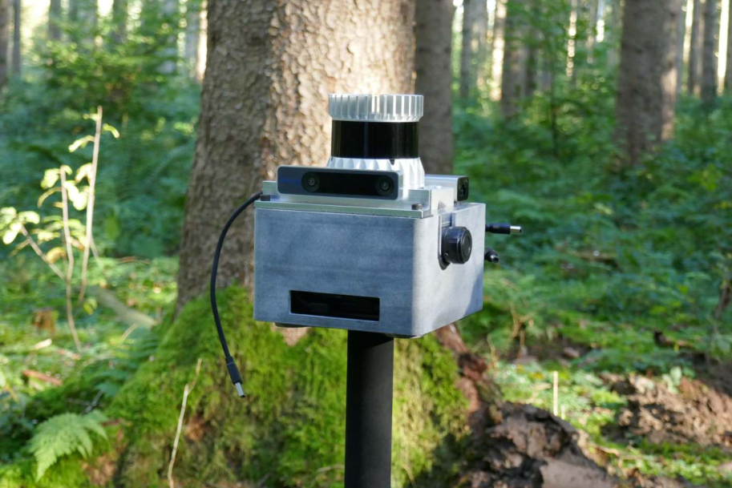
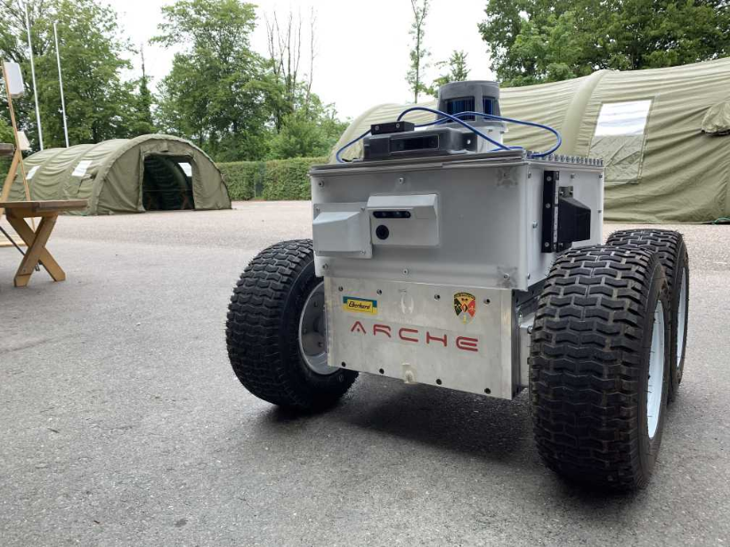
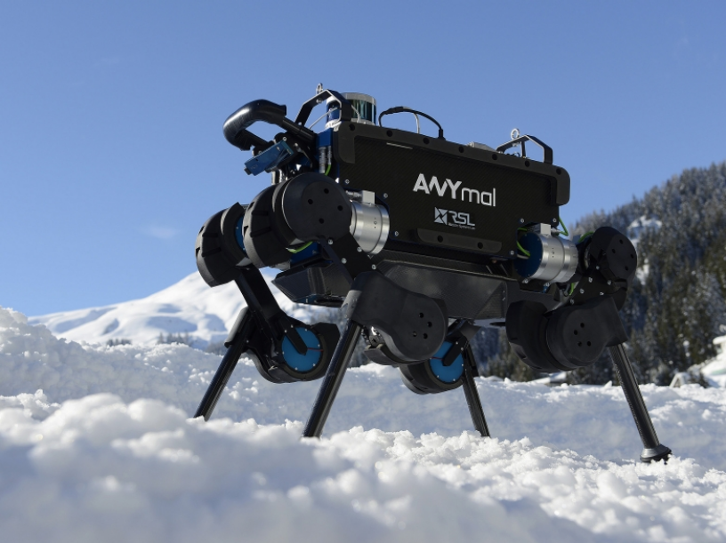

WORK IN PROGRESS

# Localization using ICP in a known map

## Overview

This package localizes the lidar sensor in a given map using the ICP algorithm. It subscribes to lidar scan and it registers them in a given map. If provided, it can use odometry or IMU to extrapolate the pose between the two iterations of ICP.

The user should provide a reference map (point cloud) as as a `.pcd` file and an initial pose in the reference map.

Released under [BSD 3-Clause license](LICENSE). Parts of the code in this repo have been inspired by the code inside google cartogrpaher. We've retained the copyright headers where applicable.

**Author:** Edo Jelavic

**Maintainer:** Edo Jelavic, [jelavice@ethz.ch](jelavice@ethz.ch)

The package has been tested onthe following platforms:

| handheld | skid steer robot | legged robot |
|:--------:|------------------|--------------|
||||

## Installation

Clone the libnabo from https://github.com/leggedrobotics/libnabo :  
`git clone git@github.com:leggedrobotics/libnabo.git`  

Clone the libpointmatcher from https://github.com/leggedrobotics/libpointmatcher :  
`git clone git@github.com:leggedrobotics/libpointmatcher.git`

Clone the pintmatcher_ros from https://github.com/leggedrobotics/pointmatcher-ros :  
`git clone git@github.com:leggedrobotics/pointmatcher-ros.git`

Install pcl_ros and pcl_conversions with:  
`sudo apt install ros-noetic-pcl-ros ros-noetic-pcl-conversions`

Build with:  
`catkin build icp_localization`  

Recommended to build in release mode for performance (`catkin config -DCMAKE_BUILD_TYPE=Release`)

## Usage

This package is based on the `libpointmatcher` package which has an extensive [documentation](https://libpointmatcher.readthedocs.io/en/latest/). This package uses the ICP implementation from libpointmatcher. We provide ROS wrappers and use either odometry or IMU measurements to calculate initial guesses for the pointcloud alignment.

You can launch the program with: `roslaunch icp_localization icp_node.launch`. The `pcd_filepath` parameter in the launch file should point to the location where you stored your refrence map (pointcloud) in the `.pcd` format.

Download the example bags and 

## Configuration

The configuration is split into three `.yaml` files.  

The `icp.yaml` file configures the ICP settings such as error metric and outlier filters. Any filter that is applied to the map can also be defined here.

The `input_filters.yaml` file configures operations that are applied to each scan of the range sensors. Subsampling, croppiing and normal computation is configured in this file. Two examples have been provided (one for the velodyne puck range sensor and the other one for the ouste OS1 sensor).   

The filtering and the ICP can be configured by adding your own custom configuration `.yaml` files. Documentation on how to do that can be found [here](https://libpointmatcher.readthedocs.io/en/latest/Configuration/#creating-custom-configurations-with-yaml).  

The rest of the parameters is explained below:

* `icp_localization/initial_pose` - initial pose of the range sensor frame in the provided map.
* `icp_localization/imu_data_topic` - ROS topic on which the imu data is published
* `icp_localization/odometry_data_topic` - ROS topic on which the odometry data is published
* `icp_localization/num_accumulated_range_data` - Number of pointcloud messages that will be accumulated before trying to register them in a map. In case you are using full scans this parameter should be set to 1. In case you are publishing LIDAR packets, you need to convert them to sensor_msgs::Pointcloud2 first. At the moment there is no motion compensation implemented.
* `icp_localization/range_data_topic` - ROS topic on which the LIDAR data is published
* `icp_localization/is_use_odometry` - Whether to use odometry for initial pose prediction. If set the false, the pose extrapolator will try to use the imu data.

